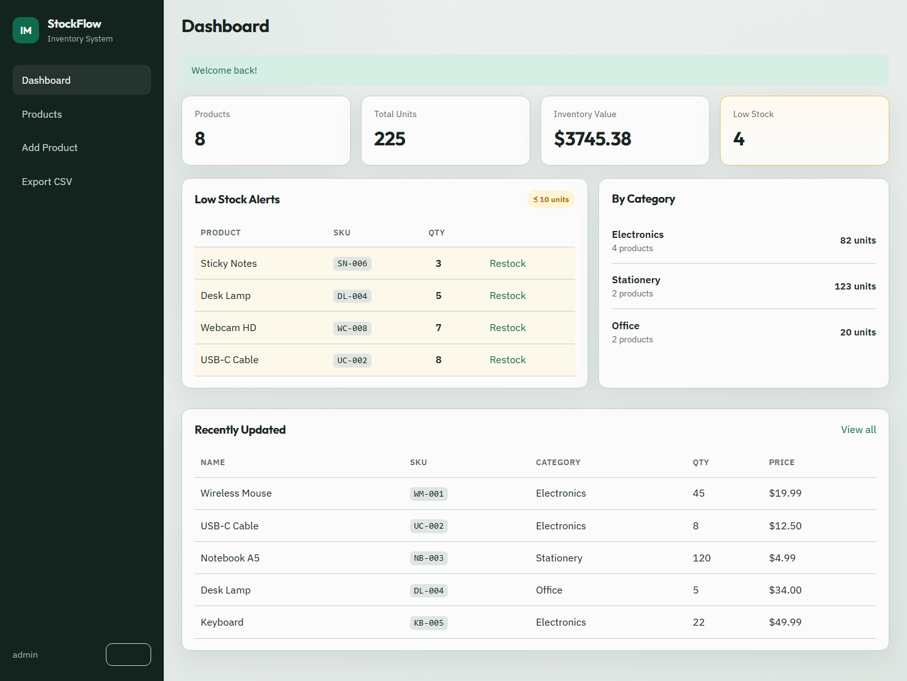
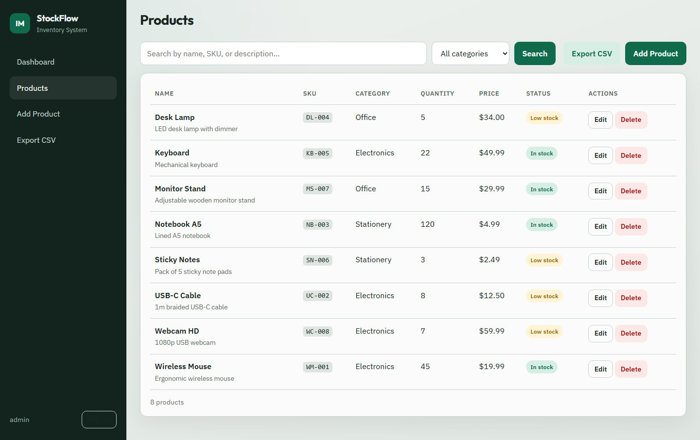
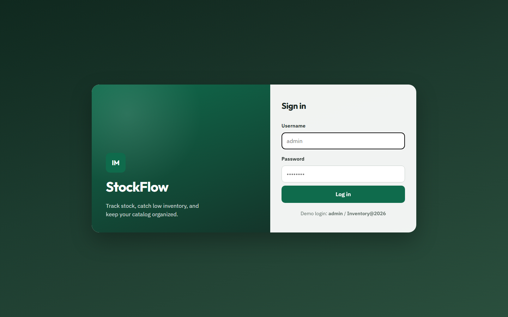

# StockFlow - Inventory Management System

A full-stack inventory management system built with Python, Flask, SQLite, HTML, CSS, and JavaScript.

Designed for small businesses to manage inventory, track stock levels, search products, and export reports.

## Live Demo

🌐 [Open StockFlow](https://inventory-management-system-ny6k.onrender.com)

**Note:** The demo uses SQLite on Render's ephemeral filesystem, so data added to the live demo may reset after a redeploy or restart. This does not affect the functionality demonstrated by the project.

## Screenshots

### Dashboard



### Products



### Login



## Features

- Secure login with hashed passwords
- Dashboard with inventory statistics
- Add, edit, and delete products
- Product search and category filtering
- Low stock alerts
- Export inventory to CSV
- Responsive user interface

## Technologies

- Python
- Flask
- SQLite
- HTML5
- CSS3
- JavaScript

## Demo Login

| Field    | Value            |
|----------|------------------|
| Username | `admin`          |
| Password | `Inventory@2026` |

## Installation

### Prerequisites

- Python 3.10+
- Git

### Setup

```bash
git clone https://github.com/Mehak-Jawaid/Inventory-Management-System.git
cd Inventory-Management-System

python -m venv venv
```

Activate the virtual environment:

**Windows:**

```bash
venv\Scripts\activate
```

**macOS/Linux:**

```bash
source venv/bin/activate
```

Install dependencies:

```bash
pip install -r requirements.txt
```

Run the application:

```bash
python app.py
```

Open:

[http://127.0.0.1:5000](http://127.0.0.1:5000)

The application creates the SQLite database and sample data automatically on first run.

## Project Structure

```text
Inventory Management System/
├── app.py
├── requirements.txt
├── Procfile
├── render.yaml
├── BUILD_GUIDE.md
├── docs/
│   └── screenshots/
├── static/
│   ├── css/
│   │   └── style.css
│   └── js/
│       └── main.js
└── templates/
    ├── base.html
    ├── login.html
    ├── dashboard.html
    ├── products.html
    └── product_form.html
```

For a detailed development walkthrough, see [BUILD_GUIDE.md](BUILD_GUIDE.md).

## Security

- Passwords are hashed using Werkzeug.
- Protected routes require authentication.
- SQL queries use parameterized placeholders to help prevent SQL injection.
- Flask `SECRET_KEY` is stored as an environment variable in production.
- The application is served through Gunicorn over HTTPS in production.

## What I Learned

- Building a full-stack Flask application
- User authentication and password hashing
- Session management
- SQLite database design and CRUD operations
- Server-side form validation
- Search and filtering
- CSV data export
- Organizing and deploying a web application

## Future Improvements

- Role-based access (Admin / Employee)
- Product image uploads
- Barcode support
- PDF report generation
- Sales management
- Supplier management
- PostgreSQL database for persistent production data

## License

This project is open source and available under the [MIT License](LICENSE).
