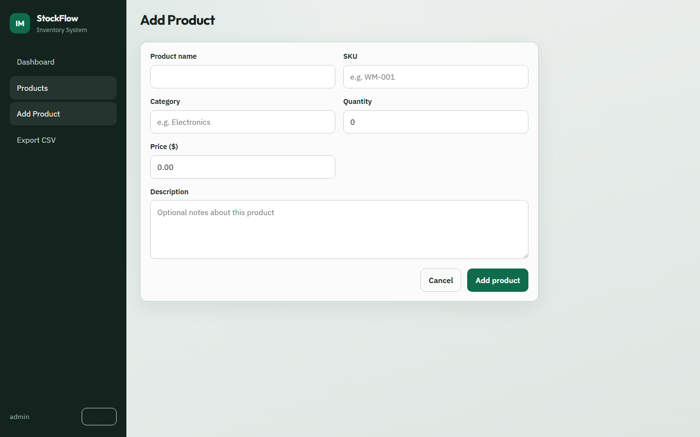

# StockFlow - Inventory Management System

A full-stack inventory management system built with Python, Flask, SQLite, HTML, CSS, and JavaScript.

Designed for small businesses to manage inventory, track stock levels, search products, and export reports.

## Screenshots

| Login | Dashboard |
|-------|-----------|
|  |  |

| Products | Add Product |
|----------|-------------|
|  |  |

## Features

- Secure login with hashed passwords
- Dashboard with inventory statistics
- Add, edit, and delete products
- Product search and category filtering
- Low stock alerts
- Export inventory to CSV
- Responsive user interface

## Technologies

- Python
- Flask
- SQLite
- HTML5
- CSS3
- JavaScript

## Installation

### 1. Prerequisites

- Python 3.10+ installed  
  Check with: `python --version`

### 2. Open the project folder

```bash
cd "Inventory Management System"
```

### 3. Create a virtual environment

```bash
python -m venv venv
```

### 4. Activate the virtual environment

**Windows (PowerShell):**

```bash
.\venv\Scripts\Activate.ps1
```

**Windows (Command Prompt):**

```bash
venv\Scripts\activate.bat
```

**macOS / Linux:**

```bash
source venv/bin/activate
```

### 5. Install dependencies

```bash
pip install -r requirements.txt
```

### 6. Run the app

```bash
python app.py
```

### 7. Open in your browser

Go to: [http://127.0.0.1:5000](http://127.0.0.1:5000)

On first run, the app creates `inventory.db` and seeds sample products automatically.

## Demo Login

| Field    | Value            |
|----------|------------------|
| Username | `admin`          |
| Password | `Inventory@2026` |

## Deploy on Render

### 1. Push the project to GitHub

Make sure this repo is on GitHub (Render deploys from a Git repo).

### 2. Create a Web Service on Render

1. Go to [https://render.com](https://render.com) and sign in (GitHub login works well).
2. Click **New +** → **Web Service**.
3. Connect the **Inventory Management System** repository.
4. Use these settings:

| Setting | Value |
|---------|--------|
| **Name** | `stockflow` (or any name you like) |
| **Runtime** | `Python 3` |
| **Build Command** | `pip install -r requirements.txt` |
| **Start Command** | `gunicorn app:app --bind 0.0.0.0:$PORT --workers 1` |
| **Instance Type** | Free |

5. Under **Environment Variables**, add:

| Key | Value |
|-----|--------|
| `SECRET_KEY` | any long random string (or click **Generate**) |

6. Click **Create Web Service** and wait for the deploy to finish.
7. Open the URL Render gives you (example: `https://stockflow.onrender.com`).

Demo login stays the same: `admin` / `Inventory@2026`.

### Notes about SQLite on Render

- The free plan uses an **ephemeral filesystem**, so product data can reset when the service redeploys or restarts.
- That is fine for a portfolio demo. Sample data is recreated automatically.
- For permanent data later, add a Render **PostgreSQL** database or a paid **persistent disk**.

You can also deploy with the included `render.yaml` via **New +** → **Blueprint**.

## Folder Structure

```text
Inventory Management System/
├── app.py                 # Flask routes, database, auth, CSV export
├── requirements.txt       # Python packages
├── Procfile               # Gunicorn start command for Render
├── render.yaml            # Optional Render Blueprint config
├── BUILD_GUIDE.md         # Step-by-step development walkthrough
├── inventory.db           # Created automatically on first run
├── docs/
│   └── screenshots/       # README screenshots
├── static/
│   ├── css/style.css      # Styling
│   └── js/main.js         # Delete confirm + mobile menu
└── templates/
    ├── base.html          # Shared layout / nav
    ├── login.html
    ├── dashboard.html
    ├── products.html
    └── product_form.html  # Add + Edit form
```

For a detailed walkthrough of how the app was built, see [BUILD_GUIDE.md](BUILD_GUIDE.md).

## Security

- Passwords are hashed (Werkzeug), not stored in plain text.
- Routes that change data require login.
- SQL uses parameterized queries (`?` placeholders) to avoid SQL injection.
- On Render, set a strong `SECRET_KEY` environment variable and serve with Gunicorn over HTTPS.

## What I Learned

- Building a Flask web application
- User authentication with hashed passwords
- CRUD operations with SQLite
- Server-side validation
- Session management
- Exporting data as CSV
- Organizing a full-stack project

## Future Improvements

- Role-based access (Admin / Employee)
- Product images
- Barcode support
- PDF report export
- Sales management
- Supplier management

## License

This project is open source and available under the [MIT License](LICENSE).
